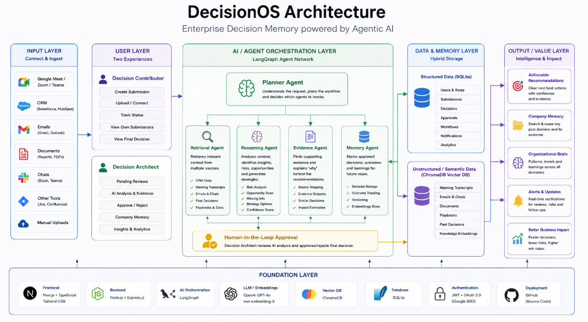
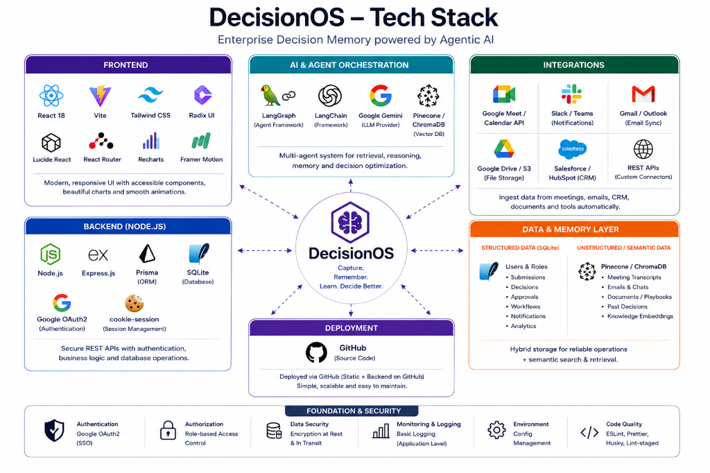

# DecisionOS SaaS Application


<br/>


<br/>


> **"Stop making the same business mistake twice."**

DecisionOS is a full-stack SaaS platform designed to empower enterprise teams with AI-driven insights. It solves the critical problem of **institutional memory loss** by capturing business decisions, routing them to Decision Architects, and determining the *Next Best Action* using a multi-agent AI pipeline. Once approved, the strategy is permanently logged into the searchable **Organizational Memory**.

---

## ✨ Key Features

- **🧠 Multi-Agent AI Orchestration**: Utilizes **LangGraph** and **Google Gemini** to orchestrate specialized AI agents (Planner, Retrieval, Context, Reasoning, Recommendation) that analyze incoming scenarios against historical enterprise data.
- **🏢 Organizational Memory Ledger**: A persistent, searchable history of past decisions, objections, and strategies so teams can leverage proven playbooks instead of reinventing the wheel.
- **⚡ Human-in-the-Loop Workflow**: Submissions are automatically analyzed, but a human "Decision Architect" maintains final approval authority, ensuring high-stakes decisions are safe and vetted.
- **🎨 Beautiful, Responsive UI**: Built with React, Tailwind CSS, and Framer Motion for a state-of-the-art, premium enterprise feel.

---

## 📈 Business Impact

Hackathon evaluators and stakeholders care about ROI. DecisionOS delivers:
- **Preserved Knowledge**: Employee turnover no longer means losing vital contextual knowledge.
- **Faster Execution**: AI instantly surfaces the exact strategy that worked last time an identical objection was raised.
- **Standardized Playbooks**: Ensures the entire organization is responding to risks, pricing pushback, and complaints with a unified strategy.

---

## 🚀 Setup & Running Instructions

This project requires **Node.js** and uses `pnpm` as its package manager.

### 1. Install Dependencies
```bash
npm install -g pnpm  # If you don't have pnpm installed
pnpm install         # Install all project dependencies
```

### 2. Environment Variables Setup
You must configure your API keys before running the AI agent backend.
Create a `.env` file in the root directory (you can copy `.env.example` if it exists) and add your Google Gemini API key:
```bash
GOOGLE_API_KEY="your-gemini-api-key-here"
```

### 3. Initialize the Database
The backend uses a local SQLite database with Prisma. Generate the tables:
```bash
cd server
npx prisma db push
cd ..
```

### 4. Start the Frontend (Vite/React)
```bash
pnpm run dev
```
*The frontend will be available at `http://localhost:5173/` or `http://localhost:5174/`.*

### 5. Start the Backend / AI Engine (Express)
Open a **new terminal tab** and run:
```bash
pnpm run server
```
*The backend server will spin up on `http://localhost:4000/`. (Note: For the hackathon demo, the frontend relies on mock data and does not strictly require the backend to be running to showcase the UI).*

---

## 🔄 How It Works
1. **Frontend**: The React UI submits the Decision Draft.
2. **Express API**: Receives the payload and initiates the LangGraph workflow.
3. **Planner Agent**: Analyzes the raw input and creates a step-by-step execution plan.
4. **Retrieval Agent**: Reaches out to Enterprise APIs (CRM, Gmail, Meet) and ChromaDB to pull historical data and context.
5. **Context Agent**: Synthesizes the retrieved data against the current customer's profile.
6. **Reasoning Agent**: Uses logical deduction models to weigh risks, impacts, and success probabilities.
7. **Recommendation Agent**: Formats the final 3 actionable strategies with confidence scores.
8. **Memory Agent**: Records the decision securely in PostgreSQL and updates the vector space in ChromaDB.

---

## 🗺️ Future Roadmap

While fully functional for this submission, our vision for DecisionOS extends much further:
- **[ ] Slack/Teams Bi-directional Bot**: Allow sales reps to submit decision requests directly from Slack threads.
- **[ ] Semantic Vector Search**: Fully implement ChromaDB to intelligently match incoming requests with past decisions based on semantic similarity, rather than just keyword tagging.
- **[ ] Automated Outcome Tracking**: Integrate with Salesforce/HubSpot to automatically track if an approved strategy *actually won the deal* 30 days later, creating a self-improving feedback loop for the AI.