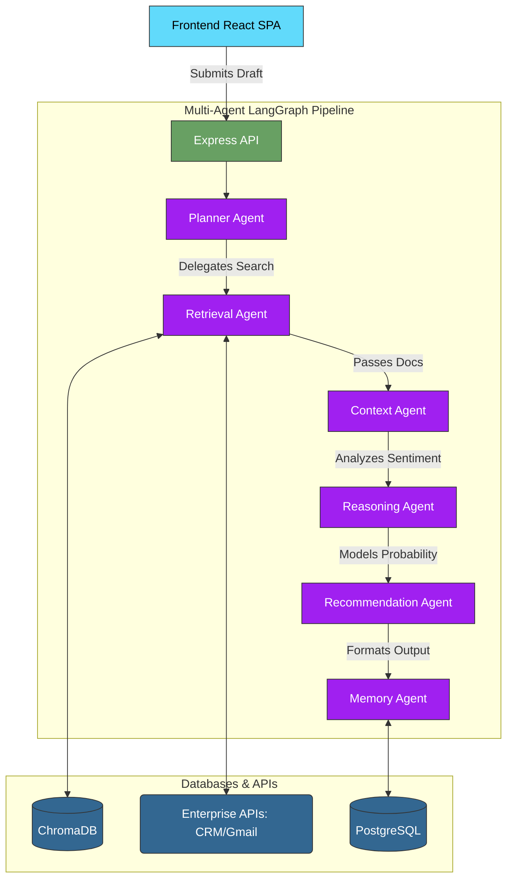

# DecisionOS SaaS Application

DecisionOS is a full-stack SaaS platform designed to empower enterprise teams with AI-driven insights. It helps Decision Architects review customer scenarios and determines the Next Best Action by orchestrating a multi-agent AI pipeline against historical data.

---

## 🚀 Setup & Running Instructions

This project requires **Node.js** and uses `pnpm` as its package manager.

### 1. Install Dependencies
```bash
npm install -g pnpm  # If you don't have pnpm installed
pnpm install         # Install all project dependencies
```

### 2. Start the Frontend (Vite/React)
```bash
pnpm run dev
```
*The frontend will be available at `http://localhost:5173/` or `http://localhost:5174/`.*

### 3. Start the Backend / AI Engine (Express)
Open a **new terminal tab** and run:
```bash
pnpm run server
```
*The backend server will spin up on `http://localhost:4000/`. (Note: For the hackathon demo, the frontend relies on mock data and does not strictly require the backend to be running to showcase the UI).*

---

## 📂 Backend Architecture

The backend implements a highly advanced **Multi-Agent Orchestration** system using LangGraph.

```text
backend/
│
├── server.js                 # Express API Entry Point
├── routes/                   # API Route definitions
│
├── agents/                   # Autonomous LangChain/LangGraph Agents
│   ├── plannerAgent.js       # Deconstructs the business problem
│   ├── retrievalAgent.js     # Fetches relevant documents
│   ├── contextAgent.js       # Analyzes customer context
│   ├── reasoningAgent.js     # Performs logical deductions
│   ├── recommendationAgent.js# Synthesizes actionable strategies
│   └── memoryAgent.js        # Updates the Company Memory ledger
│
├── orchestration/            
│   └── langgraph.js          # The LangGraph state machine & router
│
├── tools/                    # Tool definitions for Agent use
│   ├── crmTool.js            # Salesforce/HubSpot integrations
│   ├── gmailTool.js          # Email extraction
│   ├── meetTool.js           # Transcribing meeting notes
│   ├── documentRetriever.js  # RAG document fetching
│   └── vectorSearch.js       # Semantic search tools
│
├── database/                 
│   ├── prisma/               # Relational PostgreSQL DB models
│   └── chromadb/             # Vector Database for embeddings
│
├── services/                 # Core business logic
│   ├── decisionService.js
│   └── memoryService.js
│
└── data/                     # Raw datasets and logs
```

---

## 🏗️ System Architecture Flow

The system utilizes **LangGraph** to pass state between specialized AI agents, ensuring a rigorous, step-by-step decision-making process. 



### Flow Breakdown:
1. **Frontend**: The React UI submits the Decision Draft.
2. **Express API**: Receives the payload and initiates the LangGraph workflow.
3. **Planner Agent**: Analyzes the raw input and creates a step-by-step execution plan.
4. **Retrieval Agent**: Reaches out to Enterprise APIs (CRM, Gmail, Meet) and ChromaDB to pull historical data and context.
5. **Context Agent**: Synthesizes the retrieved data against the current customer's profile.
6. **Reasoning Agent**: Uses logical deduction models to weigh risks, impacts, and success probabilities.
7. **Recommendation Agent**: Formats the final 3 actionable strategies with confidence scores.
8. **Memory Agent**: Records the decision securely in PostgreSQL and updates the vector space in ChromaDB.